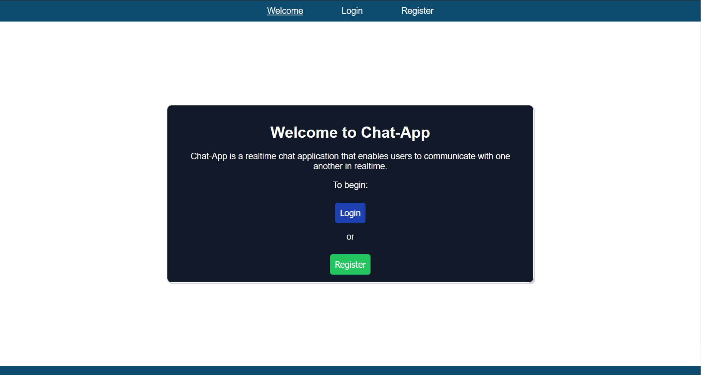
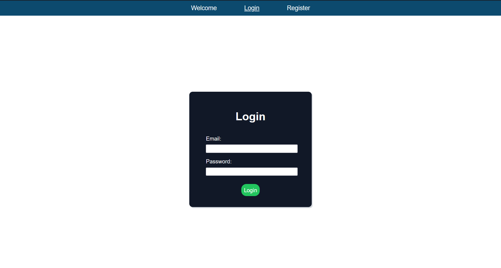
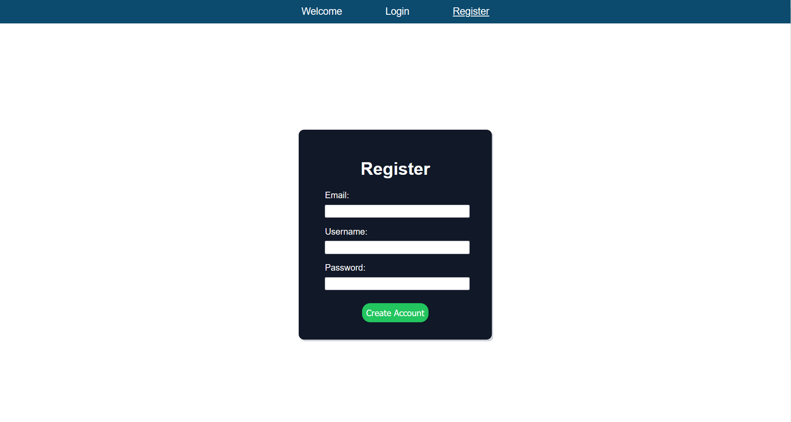
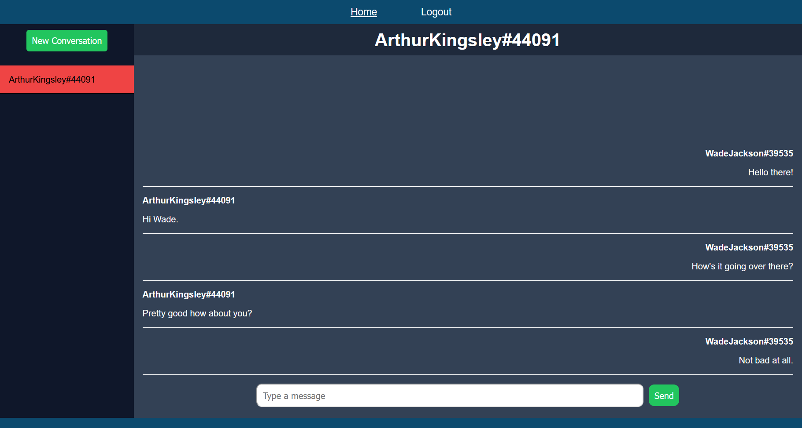
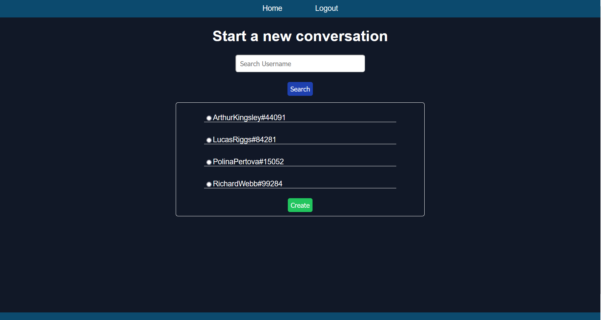

# Chat-App
Chat-App is a web application that allows users to send text-based messages to one another in real time. Allows for user account creation and authentication in order to keep message and conversation data persistent everytime the user visits the website and when visiting on different devices. Contains responsive styling to scale across devices regardless of their screen sizes.

# Tech
- Express
- MongoDB
- Node.js
- Passport.js
- RESTful API
- Socket io
- Typescript
- Vue.js

# Live Demo
Click [here](https://dreamy-lalande-295d9f.netlify.app/) for a live preview of the application.

<strong>Note:</strong> The application may take a few seconds to wake up when not in use for over 30mins.

# Screenshots
Welcome Page:

Login / Register Pages: 

Home Page:

New Conversation Page:

