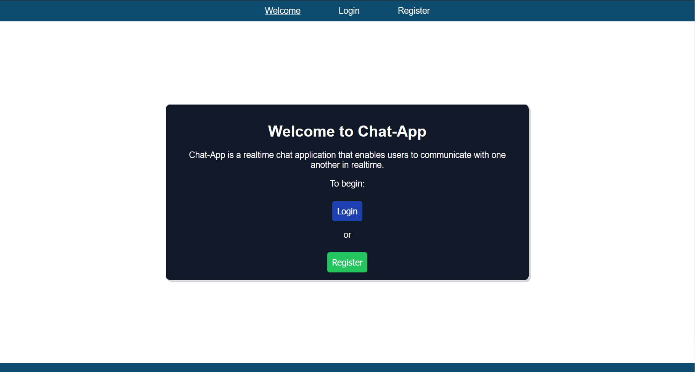
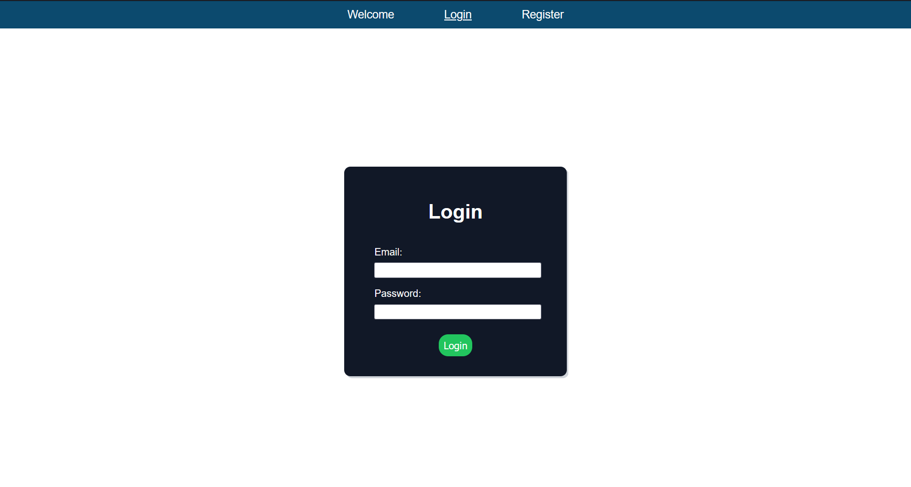
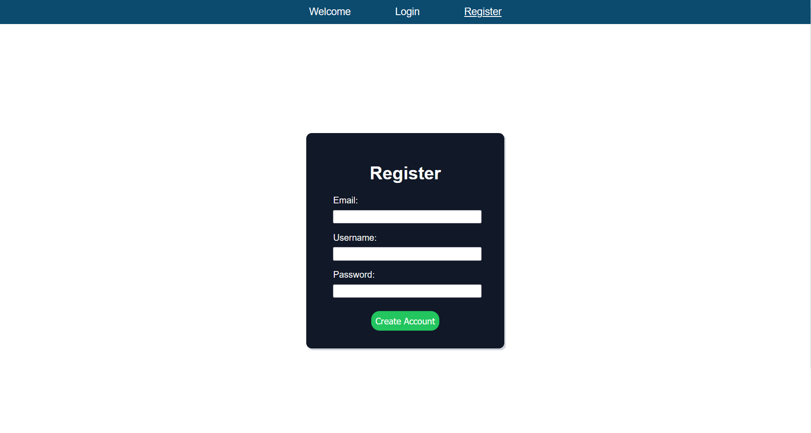
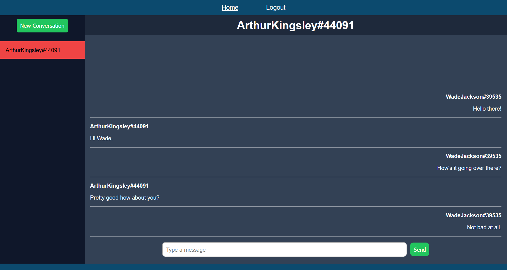
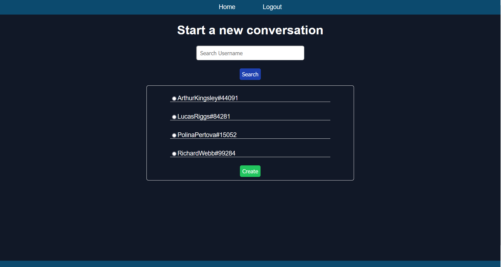

  
  <h1 align="center">Chat Application</h1>
  <a href="https://jdu-chat-app.netlify.app/">View Demo</a>
  ·
  <a href="https://github.com/Jimmy-Du/chat-application/issues">Report Bug</a>
  ·
  <a href="https://github.com/Jimmy-Du/chat-application/issues">Request Feature</a>

Allow a couple of minutes for the application to fully wake up.

## About The Project:
I created this real time chat application as a way to better understand how chat applications in the real world work behind the scenes. This chat application is a web application that allows users to send text-based messages to one another in real time. It allows for user account creation and authentication in order to keep message and conversation data persistent everytime the user visits the website and when visiting on different devices. 

## Built With:
<ul>
  <li>
    
  </li>
  <li>
    
  </li>
  <li>
    
  </li>
  <li>
    
  </li>
  <li>
    
  </li>
  <li>
    
  </li>
  <li>
    
  </li>
</ul>

## Screenshots
Welcome Page:

Login / Register Pages: 

Home Page:

New Conversation Page:

